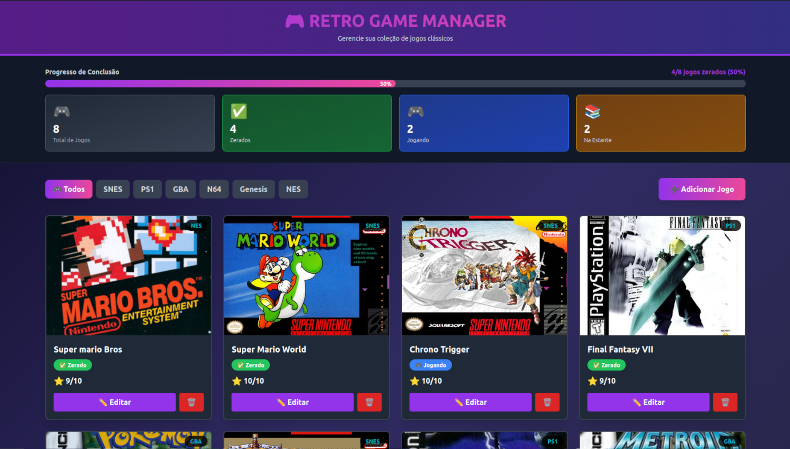

# 🎮 Retro Game Manager

> Um gerenciador de coleção de jogos retro desenvolvido como projeto final da disciplina de Desenvolvimento Web 2.



## Sobre o Projeto

O **Retro Game Manager** é uma aplicação **Fullstack (SPA)** que permite aos usuários gerenciar sua biblioteca de jogos clássicos. O sistema oferece controle total sobre o status de cada jogo (Jogando, Zerado, Na Estante), organização por console e visualização de progresso em tempo real.

O objetivo principal foi demonstrar a implementação de uma **API RESTful** robusta integrada a um Frontend reativo moderno.

## Tecnologias Utilizadas

### Frontend
- **React.js** (via Vite): Para construção da interface reativa.
- **Tailwind CSS**: Para estilização responsiva e tema "Dark/Neon".
- **Axios/Fetch**: Para consumo da API.

### Backend
- **Node.js**: Ambiente de execução do servidor.
- **Express**: Framework para gerenciamento de rotas e middleware.
- **SQLite**: Banco de dados relacional (Serverless) para persistência dos dados.
- **CORS**: Para segurança e integração entre Front e Back.

## Funcionalidades

- **CRUD Completo**: Adicionar, Listar, Editar e Remover jogos.
- **Filtros Dinâmicos**: Navegação rápida entre consoles (SNES, PS1, GBA, etc.) sem recarregamento de página.
- **Dashboard de Status**: Barra de progresso visual que calcula automaticamente a porcentagem de jogos zerados.
- **Design Responsivo**: Interface adaptada para diferentes tamanhos de tela com feedback visual imediato.

## 🔧 Instalação e Execução

Pré-requisitos: Node.js (v18+) e NPM instalados.

### 1. Clonar o repositório
```bash
git clone [https://github.com/FelipeWippel/retro-game-manager.git](https://github.com/FelipeWippel/retro-game-manager.git)
cd retro-game-manager
